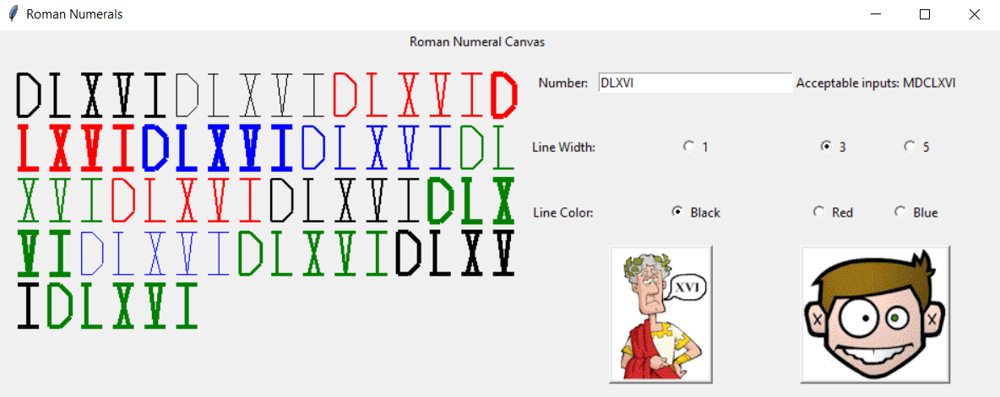

# A simple study on OOP and Python.

This OOP app creates a GUI with Tkinter to manually "draw" roman numerals that a user inputs -- acceptable inputs: MDCLXVI
The user can also customize the style of the roman numeral drawing. Pressing the "Roman" button will draw the roman numeral(s) using the style that the user chooses. Pressing the "Silly-Face" button will draw the roman numeral(s) using random styles.

